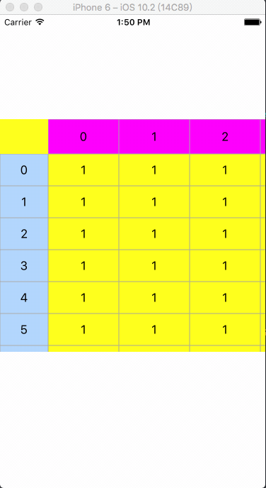

# CTDoubleList
## 预览

## 介绍
- 双向列表，上下左右滑动列表的实现。
- 关联UITableView的上下左右滑动。
- 关联UIScrollView实现左右滑动同步。

## 使用 
- 将工程里面 DoubleList 文件夹添加到工程中。
- 导入CTDoubleListView.h文件。
- 将xib文件属性关联成CTDoubleListView。
- 设置数据源。
- 具体详情使用请参照Demo里的实现。

